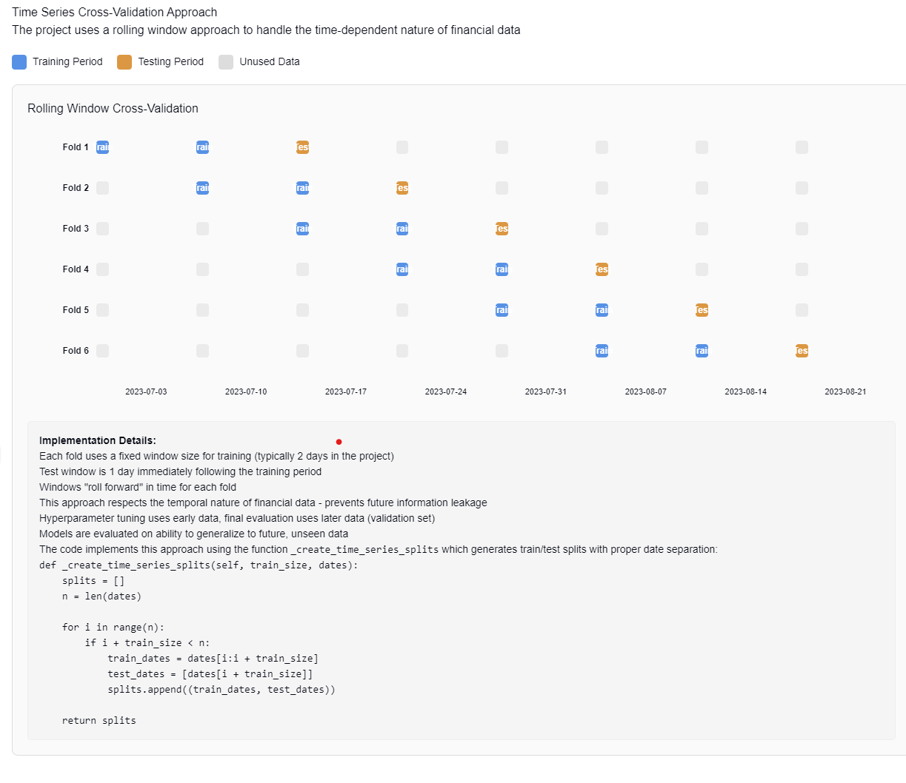

# Machine Learning for Quantitative Trading

Welcome to my research repository, where I explore applications of machine learning to quantitative trading challenges. This site contains two major research papers:

## [Iceberg Order Prediction](./iceberg-prediction-whitepaper-v2.md)

This paper presents a machine learning approach for predicting iceberg order execution in quantitative trading. We analyze market microstructure patterns to predict whether detected iceberg orders will be filled or canceled, providing valuable signals for algorithmic trading strategies.

## [Hyperparameter Optimization](./hyperparameter-optimization-whitepaper.md)

This comprehensive study examines hyperparameter optimization for machine learning models that predict iceberg order execution. The paper includes model comparison and detailed optimization results for several algorithms:

- [XGBoost](./XGBoost_hpo_report.md)
- [LightGBM](./LightGBM_hpo_report.md)
- [Random Forest](./Random_Forest_hpo_report.md)
- [Logistic Regression](./Logistic_Regression_hpo_report.md)

